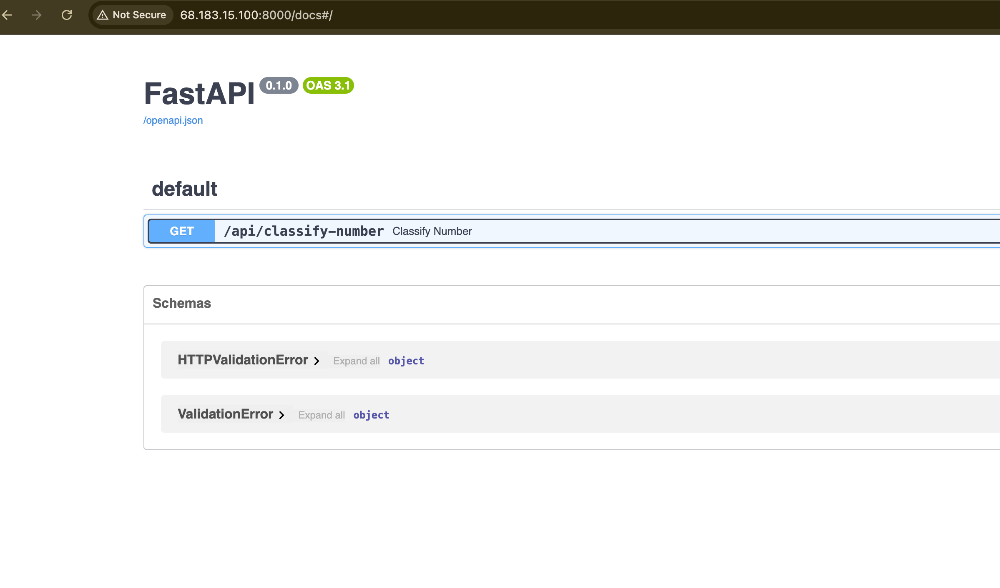

# Number Funfacts API built with fastapi.

> A simple FastAPI application that classifies numbers (prime, perfect, armstrong, odd/even) and returns fun facts about them via the [Numbers API](http://numbersapi.com).

## Table of Contents
- [Overview](#overview)
- [Features](#features)
- [Architecture](#architecture)
- [Tech Stack](#tech-stack)
- [Getting Started](#getting-started)
  - [Prerequisites](#prerequisites)
  - [Installation](#installation)
  - [Running Locally](#running-locally)
- [API Endpoints](#api-endpoints)
- [Deployment](#deployment)
- [License](#license)
- [Contributing](#contributing)

---

## Overview

This project provides an HTTP API built with **FastAPI** that:

1. Accepts a query parameter `number` (e.g. `371`).
2. Checks if the number is:
   - Prime
   - Perfect
   - Armstrong (Narcissistic)
   - Even or Odd
3. Returns a JSON response with:
   - The number
   - `is_prime`, `is_perfect` (boolean)
   - `properties` (array containing `"armstrong"` if applicable, plus either `"odd"` or `"even"`)
   - `class_sum` (sum of digits)
   - `fun_fact` (a relevant fact from the Numbers API, unless the number is armstrong, in which case a custom message is provided)

Sample success response:
```json
{
  "number": 371,
  "is_prime": false,
  "is_perfect": false,
  "properties": ["armstrong", "odd"],
  "class_sum": 11,
  "fun_fact": "371 is an Armstrong number because 3^3 + 7^3 + 1^3 = 371"
}
```

Invalid (non-numeric) response:

```json
{
  "number": "alphabet",
  "error": true
}
```
---
## Features

Number Classification: prime, perfect, armstrong, even/odd<br> 
Number Fun Fact: uses Numbers API for non-Armstrong numbers<br>
CORS Support: configurable via CORSMiddleware
Multiple Deployment Options: Render, Vercel, DigitalOcean Droplet, Docker, etc.

---
### Architecture
FastAPI powers the HTTP interface.<br>
Uvicorn is used as the ASGI server.<br>
Requests library fetches data from the Numbers API.<br>
The Numbers API provides fun facts about numbers.<br>

Directory layout:
```bash
numberfunfacts-api/
├─ main.py          # Contains the FastAPI application
├─ requirements.txt # Dependencies
├─ ...
```
---
## Tech Stack

- [python3.x](https://www.python.org/)
- [FastAPI](https://fastapi.tiangolo.com/)
- [Uvicorn](https://www.uvicorn.org/)
- [Requests](https://docs.python-requests.org/en/master/)
- [Numbers API](http://numbersapi.com)

## Getting Started
### Prerequisites<br>
- Python 3.8+ recommended

### Installation

1. Clone the repo:
```bash
git clone https://github.com/ogdmerlin/NumberFunfacts-API.git
cd NumberFunfacts-API
pip install -r requirements.txt
```
#### Running Locally
Option A: Direct Uvicorn Launch
```bash
uvicorn main:app --host 0.0.0.0 --port 8000
```
Option B: Using Python Modules
```bash
python -m uvicorn main:app --host 0.0.0.0 --port 8000
``` 
Visit http://127.0.0.1:8000/docs for the interactive Swagger UI.

>Note: I used a droplet ipaddress from didgital ocean to test the api.
---
