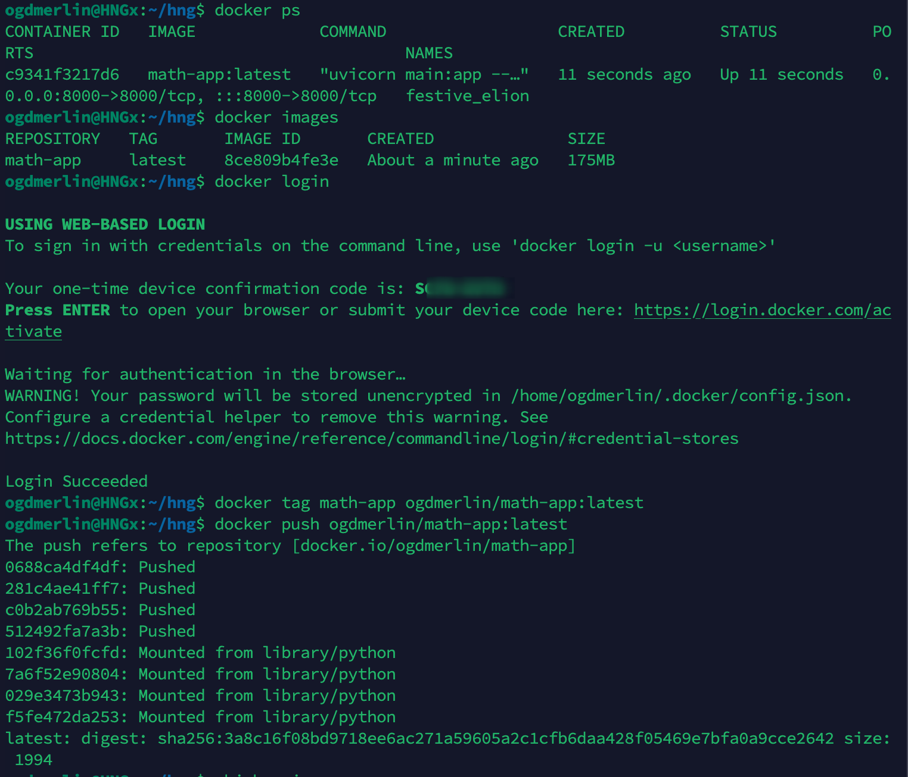

# Number Funfacts API built with fastapi.

> A simple FastAPI application that classifies numbers (prime, perfect, armstrong, odd/even) and returns fun facts about them via the [Numbers API](http://numbersapi.com).

## Table of Contents
- [Overview](#overview)
- [Features](#features)
- [Architecture](#architecture)
- [Tech Stack](#tech-stack)
- [Getting Started](#getting-started)
  - [Prerequisites](#prerequisites)
  - [Installation](#installation)
  - [Running Locally](#running-locally)
- [API Endpoints](#api-endpoints)
- [Deployment](#deployment)
- [Contributing](#contributing)
---

## Overview

This project provides an HTTP API built with **FastAPI** that:

1. Accepts a query parameter `number` (e.g. `371`).
2. Checks if the number is:
   - Prime
   - Perfect
   - Armstrong (Narcissistic)
   - Even or Odd
3. Returns a JSON response with:
   - The number
   - `is_prime`, `is_perfect` (boolean)
   - `properties` (array containing `"armstrong"` if applicable, plus either `"odd"` or `"even"`)
   - `class_sum` (sum of digits)
   - `fun_fact` (a relevant fact from the Numbers API, unless the number is armstrong, in which case a custom message is provided)

Sample success response:
```json
{
  "number": 371,
  "is_prime": false,
  "is_perfect": false,
  "properties": ["armstrong", "odd"],
  "class_sum": 11,
  "fun_fact": "371 is an Armstrong number because 3^3 + 7^3 + 1^3 = 371"
}
```

Invalid (non-numeric) response:

```json
{
  "number": "alphabet",
  "error": true
}
```
---
## Features

Number Classification: prime, perfect, armstrong, even/odd<br> 
Number Fun Fact: uses Numbers API for non-Armstrong numbers<br>
CORS Support: configurable via CORSMiddleware
Multiple Deployment Options: Render, Vercel, DigitalOcean Droplet, Docker, etc.

---
### Architecture
FastAPI powers the HTTP interface.<br>
Uvicorn is used as the ASGI server.<br>
Requests library fetches data from the Numbers API.<br>
The Numbers API provides fun facts about numbers.<br>

Directory layout:
```bash
numberfunfacts-api/
├─ main.py          # Contains the FastAPI application
├─ requirements.txt # Dependencies
├─ ...
```
---
## Tech Stack

- [python3.x](https://www.python.org/)
- [FastAPI](https://fastapi.tiangolo.com/)
- [Uvicorn](https://www.uvicorn.org/)
- [Requests](https://docs.python-requests.org/en/master/)
- [Numbers API](http://numbersapi.com)

## Getting Started
### Prerequisites<br>
- Python 3.8+ recommended

### Installation

1. Clone the repo:
```bash
git clone https://github.com/ogdmerlin/NumberFunfacts-API.git
cd NumberFunfacts-API
pip install -r requirements.txt
```
#### Running Locally
Option A: Direct Uvicorn Launch
```bash
uvicorn main:app --host 0.0.0.0 --port 8000
```
Option B: Using Python Modules
```bash
python -m uvicorn main:app --host 0.0.0.0 --port 8000
``` 
Visit http://127.0.0.1:8000/docs for the interactive Swagger UI.

>Note: I used a droplet IPaddress from didgital ocean to test the api.
---
### API Endpoints
| Endpoint              | Method | Description                                           | Example                                        |
|-----------------------|--------|-------------------------------------------------------|------------------------------------------------|
| `/api/classify-number` | GET    | Classifies a given `number` and returns its properties. | `GET /api/classify-number?number=371`         |
Query Parameters:
- number (required) – integer string (e.g. 371)


200 OK Response:
```json
{
  "number": 371,
  "is_prime": false,
  "is_perfect": false,
  "properties": ["armstrong", "odd"],
  "class_sum": 11,
  "fun_fact": "371 is an Armstrong number because 3^3 + 7^3 + 1^3 = 371"
}
``` 
400 Bad Request Response:
```json
{
  "number": "alphabet",
  "error": true
}
```
---

## Deployment
Below are some quick notes on deployment options.
### [Render](https://render.com/)
- Push code to GitHub.
- Create a new Web Service on render.com.<br>
- Use build command: pip install -r requirements.txt.<br>
- Use start command: uvicorn main:app --host 0.0.0.0 --port $PORT.<br>
- Deploy and access via your Render subdomain.<br>

Render live link https://numberfunfacts-api.onrender.com/api/classify-number?number=10 <br>
Docs link https://numberfunfacts-api.onrender.com/docs
### [Docker](https://www.docker.com/)
- Create a Dockerfile


- Build the image: 
```bash
docker build -t math-app:latest .
```


- Run the container: 
```bash
docker run -d -p 8000:8000 math-app:latest
```

- Access the API at http://68.183.15.100:8000/api/classify-number?number=371


We can now go ahead and tag our image and push it to docker hub.
```bash
docker tag math-app:latest ogdmerlin/math-app:latest
docker push ogdmerlin/math-app:latest
```


### Ubuntu Server

- Create an Ubuntu Server using your prefered cloud provider.
- SSH in, install Python 3, pip, etc.
- Clone your repo, install dependencies, and run uvicorn.

### (Optional) Create a systemd service file to keep it running in the background.

- Create a new service file:
```bash
sudo vi /etc/systemd/system/numberfunfacts.service
```
- Add the following content:
```bash
[Unit]
Description=Number Funfacts API
After=network.target

[Service]
User=ubuntu
WorkingDirectory=/home/ubuntu/numberfunfacts-api
ExecStart=/usr/bin/python3 -m uvicorn main:app --host

[Install]
WantedBy=multi-user.target

```
- Start the service:
```bash
sudo systemctl start fastapi
```
- Enable the service to start on boot:
```bash
sudo systemctl enable fastapi
```
- Check the status:
```bash
sudo systemctl status fastapi
```


> Error Explanation (status=203/EXEC)
A 203/EXEC error in systemd generally means that systemd could not execute the command specified in the ExecStart line—often because the path is incorrect or the file is not executable by the systemd service user.


> So here is the fix, i had to reference my api dependencies in the service file, and when i run it everything work as expected.


> Now the service is running in the background and i can access it via

`http:localhost:8000/api/classify-number?number=371`
 

---
## Contributing
- Fork the project<br>
- Create your feature branch: git checkout -b feature/awesome-feature<br>
- Commit changes: git commit -m "Add awesome feature"
- Push to your branch: git push origin feature/awesome-feature
- Open a pull request<br>

Contributions, issues, and feature requests are welcome!